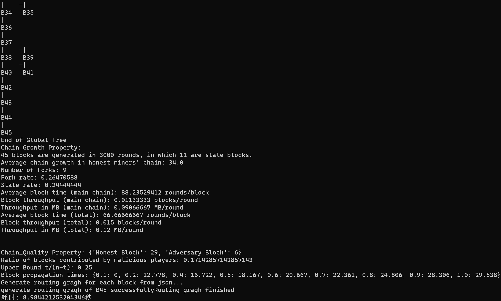
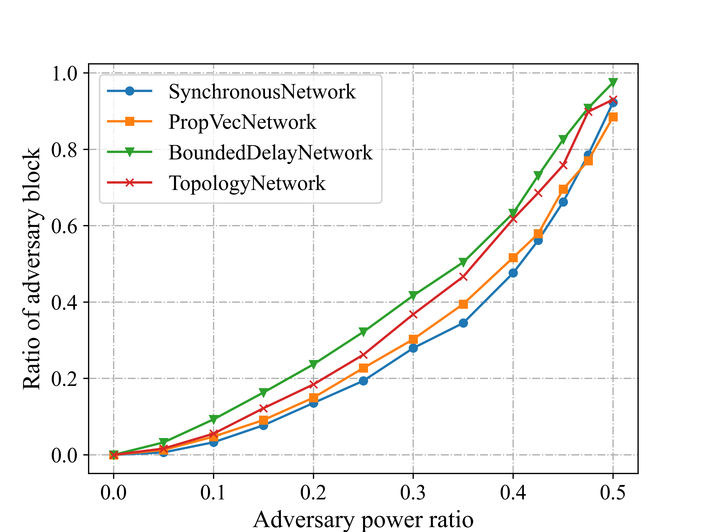
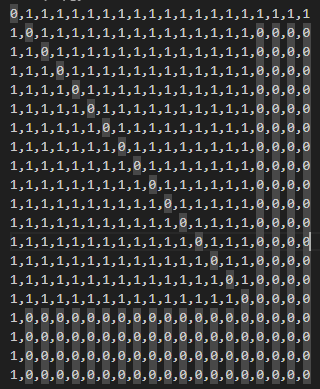

# ChainXim User Guide

## Introduction
ChainXim is a blockchain simulator developed by XinLab to simulate and verify blockchain systems under different parameter settings. We hope that ChainXim can be compatible with different consensus protocols, network models, and can design different attackers to comprehensively evaluate the blockchain's security, throughput, and other performance metrics.


## Quick Start
### Download

ChainXim repository: [https://github.com/XinLab-SEU/ChainXim](https://github.com/XinLab-SEU/ChainXim)

You can clone the Github repository with git.

Git clone command: `git clone https://github.com/XinLab-SEU/ChainXim.git`

Or you can download the master branch from the ChainXim code repository: [master.zip](https://github.com/XinLab-SEU/ChainXim/archive/refs/heads/master.zip)

### File Structure
The file structure after extracting the zip file or cloning the repository is as follows:
```
chain-xim
    ├── Attack.py
    ├── Environment.py
    ├── README.md
    ├── data
    │   ├── __init__.py
    │   ├── block.py
    │   ├── chain.py
    │   └── message.py
    ├── consensus
    │   ├── __init__.py
    │   ├── consensus_abc.py
    │   └── pow.py
    ├── errors.py
    ├── external.py
    ├── functions.py
    ├── global_var.py
    ├── main.py
    ├── miner
    │   ├── __init__.py
    │   ├── _consts.py
    │   ├── miner.py.py
    │   ├── network_interface
    │       ├── nic_abc.py
    │       ├── nic_with_tp.py
    │       └── nic_without_tp.py
    ├── network
    │   ├── __init__.py
    │   ├── adhoc.py
    │   ├── deterprop.py
    │   ├── network_abc.py
    │   ├── stochprop.py
    │   ├── synchronous.py
    │   ├── topology.py
    │   ├── topolpgy.csv
    │   ├── topolpgy_coo.csv
    │   └── topology_eclipse_sample.csv
    └── system_config.ini
```

| File or Directory         | Description                                        |
| -------------------------- | -------------------------------------------------- |
| main\.py                   | Main program of the simulator                      |
| system_config\.ini         | Configuration file                                 |
| README.md                  | User documentation                                 |
| Environment\.py            | Environment class and related functions            |
| miner/                     | Directory containing miner classes and network interfaces |
| data/                      | Directory containing Message, BlockHead, Block, Chain classes and related functions |
| consensus/                 | Directory containing abstract consensus classes, PoW classes, and related functions |
| network/                   | Directory containing various network classes       |
| Attack\.py                 | Attacker class and related functions               |
| functions\.py              | Functions including SHA256 hash calculation        |
| external\.py               | External functions for blockchain statistics |
| errors\.py                 | Error classes for throwing errors in the simulator |
| global_var\.py             | Global variables                                   |

### Configuration Environment
1. Install Anaconda. [Anaconda download link](https://www.anaconda.com/download)
2. Open Anaconda Prompt from the Start menu.
3. Create a conda environment and activate it, choosing Python version 3.10.
```
conda create -n chainxim python=3.10 python-graphviz
activate chainxim
```
4. Install the required packages via pip.
```
cd <project_directory>
pip install -r requirements.txt
```

### Simple Startup
1. Open Anaconda Prompt from the Start menu, and activate the conda environment before running.
```
activate chainxim
```
2. Run the main program in the ChainXim root directory.
```
cd <project_directory>
python main.py
```

## Test Examples
Pass the following parameters to the main program, which will make ChainXim randomly generate a miner network with 10 nodes, 2 of which are attackers, using the TopologyNetwork model, and the simulation will last for 3000 rounds.
```
python main.py --total_round 3000 --miner_num 10 -t 2 --network_type network.TopologyNetwork --no_compact_outputfile --save_routing_graph --show_label
```
After the simulation starts, it will output the simulation parameters and display a progress bar during the simulation.
```
Network Attributes
    miner_num: 10
    Generate Approach: rand
    Generate Edge Probability: 0.8
    Diameter: 2
    Average Shortest Path Length: 1.356
    Degree Histogram: [0, 0, 0, 0, 3, 1, 3, 2, 0, 1]
    Average Degree: 5.8
    Average Cluster Coefficient: 0.689
    Degree Assortativity: -0.251


Parameters:
Miner Number: 10
Adversary Miners: [8, 6]
Consensus Protocol: PoW
Network Type: TopologyNetwork
Network Param:  {'show_label': True, 'save_routing_graph': True, 'ave_degree': 8.0, 'bandwidth_honest': 0.5, 'bandwidth_adv': 5.0, 'TTL': 500, 'gen_net_approach': 'rand', 'block_prop_times_statistic': [0.1, 0.2, 0.4, 0.5, 0.6, 0.7, 0.8, 0.9, 1.0]}
Consensus Param: {'target': '000FFFFFFFFFFFFFFFFFFFFFFFFFFFFFFFFFFFFFFFFFFFFFFFFFFFFFFFFFFFFF', 'q_ave': 5, 'q_distr': 'equal'}
Attack Execute Type: execute_sample1
```
After the simulation ends, the simulation results will be shown:



In addition, various data generated during the simulation will be saved in the Results folder, including each miner's blockchain records, blockchain visualization graphics, blockchain attacker logs, routing history, network topology, block propagation diagrams, etc. Note that if the command line parameters `--no_compact_outputfile --save_routing_graph` are missing, some files may not be output.

-----
Blockchain visualization graphic ([blockchain_visualization/Blockchain Structure.gv.svg](doc/Blockchain-Structure.svg))
<br><br/>

{: style="height: 400px"}
<br><br/>
Red blocks in the figure are generated by attackers, and blue blocks are generated by honest miners.

-----
Blockchain visualization diagram ([blockchain visualisation.svg](doc/blockchain-visualisation.svg))


Each point in the figure represents a block, with blue points representing blocks generated by honest miners and red points representing blocks generated by attackers. The x-coordinate of each point represents the round in which the block was generated, and the y-coordinate represents the height of the block. **Note: If too many rounds are run, resulting in too many blocks, the generated image may become crowded and difficult to distinguish.**

-----
Block generation time distribution histogram ([block interval distribution.svg](doc/block interval distribution.svg))


-----
Network topology diagram ([Network Results/network topology.svg](doc/network-topology.svg))


The transmission bandwidth between adjacent nodes is marked in the figure, with the unit being MB/round.

-----
Block propagation diagram (taking block B2 as an example: [Network Results/routing_graphB2.svg](doc/routing-graphB2.svg))


The above figure shows the entire process of block B2 propagating from node 6 to the entire network. Each solid arrow in the figure is marked with two pairs of positive numbers. The first pair identifies the source miner and target miner IDs of a certain propagation process, and the second pair identifies the start and end rounds of a certain propagation process.

## Simulator Input Parameters
The input parameters of the simulator can be specified in two ways: command line and configuration file. Generally, you can modify the configuration file system_config.ini that comes with ChainXim to change the simulation parameters, or you can specify individual simulation parameters through the command line. The command line supports fewer parameters than the configuration file, but once specified, they take precedence over the configuration file. You can view the command line help information by using the command `python main.py --help`.

### EnvironmentSettings

Configure the simulation environment

| system_config      | Command Line Example                          | Type  | Description                                                  |
| ------------------ | --------------------------------------------- | ----- | ------------------------------------------------------------ |
| total_round        | `--total_round 50`                            | int   | Total number of simulation rounds                            |
| process_bar_type   | `--process_bar_type round`                    | str   | Progress bar display style (round or height)                 |
| miner_num          | `--miner_num 80`                              | int   | Total number of miners in the network                        |
| blocksize          | `--blocksize 8`                               | float | Block size, in MB                                            |
| consensus_type     | `--consensus_type consensus.PoW`              | str   | Consensus type, currently only `consensus.PoW` is available  |
| network_type       | `--network_type network.SynchronousNetwork `  | str   | Network type, should be one of `network.SynchronousNetwork`,<br/>`network.PropVecNetwork`, `network.BoundedDelayNetwork`,<br/>`network.TopologyNetwork`, `network.AdHocNetwork` |
| show_fig           | `--show_fig`                                  | bool  | Whether to display images during the simulation              |
| compact_outputfile | `--no_compact_outputfile`                     | bool  | Whether to simplify log and result output to save disk space<br/>Set to False via `--no_compact_outputfile` |

### ConsensusSettings

Configure consensus protocol parameters

| system_config | Command Line Example       | Type | Description                                                  |
| ------------- | -------------------------- | ---- | ------------------------------------------------------------ |
| q_ave         | `--q_ave 5`                | int  | Average hash rate of a single miner, i.e., the number of hash calculations per round |
| q_distr       | `--q_distr equal`          | str  | Hash rate distribution mode<br>equal: All miners have the same hash rate;<br>rand: Hash rate follows a Gaussian distribution |
| target        | None                       | str  | PoW target value in hexadecimal format                       |
| None          | `--difficulty 12`          | int  | PoW difficulty represented by the length of the prefix zeros in the binary PoW target value,<br/>converted to the PoW target value in the main program |

### AttackModeSettings

Configure attack mode parameters

| system_config       | Command Line Example                          | Type       | Description                                                  |
| ------------------- | --------------------------------------------- | ---------- | ------------------------------------------------------------ |
| t                   | `-t 0`                                        | int        | Total number of attackers                                     |
| adversary_ids       | None                                          | tuple[int] | Attacker IDs e.g.(1,3,5)                                     |
| attack_execute_type | `--attack_execute_type execute_sample1 `      | str        | Attack type<br>execute_sample0: Hash power attack;<br>execute_sample1: Selfish mining |

### DeterPropNetworkSettings

Configure DeterPropNetwork parameters

| system_config | Type        | Description                                                  |
| ------------- | ----------- | ------------------------------------------------------------ |
| prop_vector   | list[float] | Propagation vector (in list form) e.g.[0.1, 0.2, 0.4, 0.6, 1.0] where the elements represent the proportion of miners receiving the message after (1,2,3...) rounds, the last element must be 1.0 |

### StochPropNetworkSettings

Configure StochPropNetwork parameters

| system_config              | Command Line Example          | Type        | Description                                   |
| -------------------------- | ----------------------------- | ----------- | --------------------------------------------- |
| rcvprob_start              | `--rcvprob_start 0.001`       | float       | Initial message reception probability         |
| rcvprob_inc                | `--rcvprob_inc 0.001`         | float       | Incremental message reception probability per round |
| block_prop_times_statistic | None                          | list[float] | Block propagation times corresponding to the proportion of receiving miners |

### TopologyNetworkSettings

Configure TopologyNetwork parameters

| system_config          | Command Line Example            | Type        | Description                                                  |
| ---------------------- | ------------------------------- | ----------- | ------------------------------------------------------------ |
| init_mode              | `--init_mode rand`              | str         | Network initialization method, 'adj' adjacency matrix, 'coo' sparse adjacency matrix, 'rand' randomly generated. 'adj' and 'coo' network topologies are given via csv files. 'rand' requires specifying bandwidth, degree, etc. |
| bandwidth_honest       | `--bandwidth_honest 0.5`        | float       | Network bandwidth between honest miners and between honest miners and attackers, in MB/round |
| bandwidth_adv          | `--bandwidth_adv 5`             | float       | Bandwidth between attackers, in MB/round                     |
| rand_mode              | `--rand_mode homogeneous`       | str         | Random network topology generation mode<br />'homogeneous': Generate network based on ave_degree and try to keep each node's degree the same<br />'binomial': Use Erdős-Rényi algorithm, randomly establish links between nodes with probability `ave_degree/(miner_num-1)` |
| ave_degree             | `--ave_degree 8`                | float       | When the network generation method is 'rand', set the topology average degree |
| stat_prop_times        | None                            | list[float] | Block propagation times corresponding to the proportion of receiving miners |
| outage_prob            | `--outage_prob 0.1`             | float       | Probability of each link outage per round, messages will be retransmitted in the next round if the link is down |
| dynamic                | `--dynamic`                     | bool        | Whether to make the network dynamic, if dynamic, links between nodes will be added or deleted with a certain probability |
| avg_tp_change_interval | None                            | float       | When dynamic=true, set the average round interval for topology changes |
| edge_remove_prob       | None                            | float       | When dynamic=true, set the probability of removing existing edges during topology changes |
| edge_add_prob          | None                            | float       | When dynamic=true, set the probability of establishing new connections for non-existing edges during topology changes |
| max_allowed_partitions | None                            | int         | When dynamic=true, set the maximum number of partitions allowed during topology changes |
| save_routing_graph     | `--save_routing_graph`          | bool        | Whether to save the routing propagation graph of each message, recommended to turn off when the network scale is large |
| show_label             | `--show_label`                  | bool        | Whether to display labels on the topology or routing propagation graph, recommended to turn off when the network scale is large |

### AdHocNetworkSettings

Configure AdHocNetwork parameters

| system_config   | Command Line Example         | Type        | Description                                                   |
| --------------- | ---------------------------- | ----------- | ------------------------------------------------------------- |
| init_mode       | `--init_mode rand`           | str         | Network initialization method, only 'rand' is valid for AdhocNetwork |
| ave_degree      | `--ave_degree 3`             | float       | When the network generation method is 'rand', set the topology average degree |
| segment_size    | `--ave_degree 8`             | float       | Message segment size; divide the complete message into several segments, each segment takes one round to propagate |
| region_width    | `--region_width 100`         | float       | Width of the square region, nodes perform Gaussian random walks within this region |
| comm_range      | `--comm_range 30`            | float       | Node communication range, automatically establish connections between nodes within the communication range |
| move_variance   | `--move_variance 5`          | float       | Variance of the xy coordinate movement distance when nodes perform Gaussian random walks |
| outage_prob     | `--outage_prob 0.1`          | float       | Probability of each link outage per round, messages will be retransmitted in the next round if the link is down |
| stat_prop_times | None                         | list[float] | Block propagation times corresponding to the proportion of receiving miners |


## Simulator Output
After the simulation ends, the global chain statistics during the simulation will be printed in the terminal. Example:
```
162 blocks are generated in 26682 rounds, in which 61 are stale blocks.
Average chain growth in honest miners' chain: 100.013
Number of Forks: 54
Fork rate: 0.53465347
Stale rate: 0.37654321
Average block time (main chain): 264.17821782 rounds/block
Block throughput (main chain): 0.00378532 blocks/round
Throughput in MB (main chain): 0.12113035 MB/round
Average block time (total): 164.7037037 rounds/block
Block throughput (total): 0.00607151 blocks/round
Throughput in MB (total): 0.19428828 MB/round


Chain_Quality Property: {'Honest Block': 102, 'Adversary Block': 0}
Ratio of blocks contributed by malicious players: 0.0
Upper Bound t/(n-t): 0.0
Block propagation times: {0.1: 60.553, 0.2: 77.534, 0.4: 105.994, 0.5: 109.826, 0.6: 113.23, 0.7: 116.522, 0.8: 120.658, 0.9: 126.447, 1.0: 148.327}
```
The meaning of the simulation results displayed in the terminal is as follows:

| Output Item                                         | Explanation                                                  |
| --------------------------------------------------- | ------------------------------------------------------------ |
| Number of stale blocks                              | Number of stale blocks (blocks not in the main chain)        |
| Average chain growth in honest miners' chain        | Average chain growth of honest nodes                         |
| Number of Forks                                     | Number of forks (only counting the main chain)               |
| Fork rate                                           | Fork rate = number of heights with forks on the main chain / main chain height |
| Stale rate                                          | Stale rate = number of stale blocks / total number of blocks |
| Average block time (main chain)                     | Average block time of the main chain = total rounds / main chain length (rounds/block) |
| Block throughput (main chain)                       | Block throughput of the main chain = main chain length / total rounds |
| Throughput in MB (main chain)                       | Block throughput of the main chain * block size              |
| Average block time (total)                          | Total average block time = total rounds / total number of blocks generated |
| Block throughput (total)                            | Total block throughput = total number of blocks generated / total rounds |
| Throughput in MB (total)                            | = Total block throughput * block size                        |
| common prefix pdf                                   | PDF obtained from common prefix statistics (statistics of the difference between the common prefix of all honest nodes' chains and the longest chain length at the end of each round, resulting in a probability density distribution) |
| Consistency rate                                    | Consistency metric = common_prefix_pdf[0]                   |
| Chain_Quality Property                              | Total number of blocks generated by honest and malicious miners |
| Ratio of blocks contributed by malicious players    | Proportion of blocks generated by malicious nodes            |
| Upper Bound t/(n-t)                                 | Upper bound of the proportion of blocks generated by malicious nodes (n is the total number of miners, t is the number of malicious miners) |
| Block propagation times                             | Block propagation times (distribution)                       |


During the simulation, results, logs, and images are saved in the Results/\<date-time\>/ directory, where date-time is the date and time when the simulation starts. The typical file structure of this directory is as follows:
```
Results/20230819-232107/
├── Attack_log.txt
├── Attack_result.txt
├── Chain Data
│   ├── chain_data.txt
│   ├── chain_data0.txt
│   ├── chain_data1.txt
│   ├── ......
├── Network Results
│   ├── ......
├── block interval distribution.svg
├── blockchain visualisation.svg
├── blockchain_visualization
│   ├── Blockchain Structure.gv
│   └── Blockchain Structure.gv.svg
├── evaluation results.txt
├── events.log
└── parameters.txt
```
The meaning of the output simulation result files is as follows:

| File or Directory | Description | 
| -------- | -------- |
| Attack_log.txt  | Attack log |
| Attack_result.txt | Attack results |
| Chain Data/ | Complete data of the global chain and local chains of each miner |
| Network Results/ | Network transmission results, such as propagation process (when each miner receives a certain block), network topology, routing process diagrams, etc. |
| block interval distribution.svg | Block interval distribution |
| blockchain visualisation.svg | Blockchain visualization |
| blockchain_visualization/ | Blockchain visualization using Graphviz |
| evaluation results.txt | Evaluation results |
| events.log | Simulation process log, recording important events such as block generation, network access, etc. |
| parameters.txt | Simulation environment parameters |

## Simulation Examples
### Relationship between the Number of Miners and Block Time in Synchronous Network
Synchronous Network: X-axis represents the number of miners, Y-axis represents the block time.

**Parameter settings:**

* Simulation rounds: 200000 rounds * 1 time

* Number of miners: 10-80

* Consensus type: PoW

* Difficulty: 0000FF...

* q_ave = 10

* Network parameters: SynchronousNetwork

{: style="height: 460px"}


### Double Spending Attack Success Rate
**Parameter settings:**

* Simulation rounds: 1200000 rounds * 1 time

* Number of miners: 40

* Consensus type: PoW

* Difficulty: 000FFF...

* q_ave = 1

* Network parameters: default for all four network types

{: style="height: 460px"}

---


**Advanced Performance Display**


### Fork Rate, Stale Block Rate, Throughput, and Consistency under Different Maximum Delays in Various Networks

- Rounds: 100000
- Number of miners: 100
- Consensus type: PoW
- q_ave: 10
- Difficulty: 0002FF...
- Network types: SynchronousNetwork and BoundedDelayNetwork
- Network parameters: rcvprob_start=rcvprob_inc=1/maximum rounds

---
Fork rate/Stale block rate and throughput variation with maximum propagation delay

{: style="height: 460px"}

---
Consistency metrics variation with maximum propagation delay

{: style="height: 460px"}

In the figure, Common Prefix[0], [1], [2] represent the first three components of the common prefix PDF, where the ordinal number represents the difference between the common prefix and the main chain length (see the "Simulator Output" section for details).
### Common Prefix Property of Blockchain under Topology Network

- Rounds: 16189
- Number of miners: 10
- Consensus type: PoW
- Difficulty: 000FFF...
- Network type: TopologyNetwork
- Network parameters: gen_net_approach=adj; bandwidth_honest=0.5

At the end of each round, the height difference of the local chains of all nodes relative to the common prefix and its impact on the Common Prefix PDF are shown in the figure below. The time axis below is the round in which the chain tail switch event occurred, the upper x-axis is the block height/common prefix followed by the block length (suffix length), and the y-axis is the miner ID. The heat value in the figure indicates the cumulative number of times each miner's local chain tail reaches the suffix length relative to the common prefix. BXX in the figure refers to the block number, representing the state of the miner's local chain tail in the current round, and the lower x-axis indicates the height of these blocks. Click Play to start the animation, where you can observe the block being generated to extend the common prefix, then propagating to other miners, and finally causing the common prefix height to increase by 1.

<style>
	.iframe-body-sty{position: relative;overflow: hidden;height:850px;width: 850px;background-color: white;
    transform: scale(0.8); transform-origin:0 0; margin-bottom: -170px}
</style>

<div class="iframe-body-sty">
<iframe
 height=850px
 width=850px
 src="/chainxim-documentation/doc/cp_pdf.html"  
 frameborder=0 
 display:block>
 </iframe>
</div>


### Fork Rate, Stale Block Rate, Throughput, and Consistency under Different Block Sizes

- Rounds: 500000
- Number of repetitions per point on the curve: 5
- Number of miners: 20
- Consensus type: PoW
- Difficulty: 0000FF...
- Network type: TopologyNetwork
- Network parameters: TTL=500; gen_net_approach=rand; ave_degree=8; bandwidth_honest=0.5; bandwidth_adv=5; block_prop_times_statistic=[0.1, 0.2, 0.4, 0.5, 0.6, 0.7, 0.8, 0.9, 1.0]

---
Fork rate/Stale block rate and throughput variation with block size
{: style="height: 460px"}

---
Consistency metrics variation with block size
{: style="height: 460px"}

In the figure, Common Prefix[0], [1], [2] represent the first three components of the common prefix PDF, where the ordinal number represents the difference between the common prefix and the main chain length (see the "Simulator Output" section for details).
### Variation of Propagation Delay with Block Size

- Rounds: 100000
- Number of miners: 100
- Consensus type: PoW
- q_ave: 10
- Difficulty: 00008F...
- Network type: TopologyNetwork
- Network parameters: TTL=500; gen_net_approach=rand; ave_degree=8; bandwidth_honest=0.5; bandwidth_adv=5; block_prop_times_statistic=[0.1, 0.2, 0.4, 0.5, 0.6, 0.7, 0.8, 0.9, 1.0]

---
Variation of propagation delay and 90% effective throughput with block size

{: style="height: 460px"}

**Note: X% effective throughput = block size / (X% block propagation delay)**

### Attacker's Block Proportion under Different Attack Vectors

#### 1. Hash Power Attack (honest mining)

{: style="height: 460px"}

##### **Impact of Four Different Networks on Hash Power Attack**
Definition of a successful attack: The attacker produces a block and is accepted by the network.

**Parameter settings:**

* Rounds: 100000

* Repetitions per point on the curve: 20

* Number of miners: 40

* Consensus type: PoW

* Difficulty: 000FFF...

* q_ave = 1

* Network parameters: default for all four network types

---
#### 2. Selfish Mining Attack
##### **Impact of Four Different Networks on Selfish Mining Attack**

{: style="height: 460px"}

The vertical axis represents the chain quality metric, i.e., the proportion of blocks produced by the attacker in the main chain.

**Parameter settings:**

* Simulation rounds: 100000 rounds * 20 times

* Number of miners: 40

* Consensus type: PoW

* Difficulty: 000FFF...

* q_ave = 1

* Network parameters: default for all four network types

---

##### **Impact of Different Miner Chain Selection Strategies on Selfish Mining Attack**

{: style="height: 460px"}

The theoretical region in the figure is obtained by the following formula:

$$ R=\frac{\alpha(1-\alpha)^{2}(4\alpha+\gamma(1-2\alpha))-\alpha^{3}}{1-\alpha(1+(2-\alpha)\alpha)} $$

$\alpha$ is the proportion of the attacker's hash power to the total network, $0\leqslant\alpha\leqslant\frac{1}{2}$.
$\gamma$ is the proportion of honest miners who choose to mine on the attack chain when there is a fork between the honest chain (the latest block is produced by an honest node) and the attack chain (all blocks from a certain block to the latest block are produced by the attacker), $0\leqslant\gamma\leqslant1$.
Note: The chain selection strategy is an internal test functionality and is not yet available. However, this simulator follows the mining strategy of $\gamma=0$, which means all honest nodes default to continue mining on the honest chain branch. Therefore, users can use the following theoretical curve formula for verification.

$$ R=\frac{4\alpha^{2}(1-\alpha)^{2}-\alpha^{3}}{1-\alpha(1+(2-\alpha)\alpha)} $$

**Parameter settings:**

* Simulation rounds: 100000 rounds * 20 times

* Number of miners: 40

* Consensus type: PoW

* Difficulty: 000FFF...

* q_ave = 1

* Network type: SynchronousNetwork

---
#### 3. Double Spending Attack

##### **Impact of Different Networks on Double Spending Attack**

{: style="height: 460px"}

**Parameter settings:**

* Simulation rounds: 1200000 rounds * 1 time

* Number of miners: 40

* Consensus type: PoW

* Difficulty: 000FFF...

* q_ave = 1

* Network parameters: default for all four network types

---
##### **Impact of Different Strategies on Double Spending Attack and Theoretical Comparison**

{: style="height: 460px"}

The theoretical curve in the figure is obtained by the following formula:

$$P(N,N_g,\beta)=1-\sum_{n=0}^{N}\begin{pmatrix}n+N-1\\
n
\end{pmatrix}\left(\frac{1}{1+\beta}\right)^{N}\left(\frac{\beta}{1+\beta}\right)^{n}\left(\frac{1-\beta^{N-n+1}}{1-\beta^{Ng+1}}\right)$$

$N$ is the number of blocks the attacker waits for confirmation, i.e., the attacker will wait for the honest chain to grow by $N$ blocks before deciding whether to publish.
$N_g$ indicates that the attacker abandons the current attack when it is $N_g$ blocks behind the honest chain.
$\beta$ is the ratio of the attacker's hash power to that of the honest miners, $0\leqslant\beta\leqslant1$.

**Parameter settings:**

* Simulation rounds: 3000000 rounds * 1 time

* Number of miners: 40

* Consensus type: PoW

* Difficulty: 000FFF...

* q_ave = 1

* Network type: SynchronousNetwork

---

#### 4. Eclipse Attack

##### **Double Spending Attack under Eclipse Attack**

{: style="height: 460px"}

The green curve Theory Shift 10% is obtained by shifting the Theory curve to the left by one unit.

{: style="height: 460px"}

**Parameter settings:**

* Simulation rounds: 3000000 rounds * 1 time

* Number of miners: 20

* Consensus type: PoW

* Difficulty: 000FFF...

* q_ave = 1

* Network type: TopologyNetwork

* Network parameters: The Full connect topology, Random connect topology, Eclipse 10% miners, and Eclipse 20% miners in the figure use fixed adjacency matrices to generate the topology network. Their adjacency matrices are $TP_F$, $TP_R$, $TP_1$, and $TP_2$, respectively, and other settings are default.
    - The $TP_F$ matrix has all elements as 1 except for the diagonal elements which are 0.
    - The $TP_R$ matrix is a randomly generated topology network.
    - The $TP_1$ matrix is as shown below (isolated nodes are 18, 19):
        
    - The $TP_2$ matrix is as shown below (isolated nodes are 16, 17, 18, 19):
        
        

**Note: When setting attackers, please avoid isolated nodes and set them manually.**


## Developer's Document
See [developer-guide](developer-guide_en.md) for more details

## Contributors
曹苇杭 Weihang Cao

* Project leader, overall framework, coding for the consensus layer and the evaluation layer

陈炳文 Bingwen Chen

* Coding for the network layer

陈阳 Yang Chen

* Coding for the attack layer

崔自翔 Zixiang Cui

* Optimization of the consensus layer and the underlying frameworks

陈喜年 Xinian Chen

* Testing and optimization

凌昕彤 Xintong Ling

* Advisor